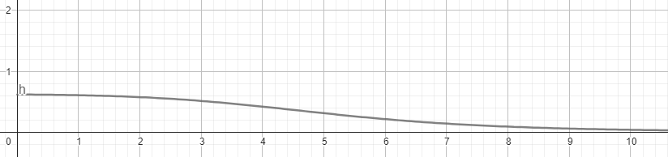

## Problema 1

Propiedades de las funciones de riesgo. Supongamos que una variable aleatoria de supervivencia T con densidad una mezcla de dos exponenciales

\begin{equation}
f_T(t)=p \lambda e^{-\lambda t} + (1-p) \mu e^{-\mu t}; \ \ \ t \geq 0
\end{equation}

donde $0<p<1$ es el parámetro de proporción de la mezcla $0<\lambda<\mu<1$ son parámetros de cada exponencial en la mezcla.

  a) Encuentre  la función de supervivencia $S(t)$.
  b) Encuentre la función de riesgo $h(t)$ para $T$ y explique analíticamente o intuitivamente por qué es decreciente en función de su argumento positivo $t$.

### Solución a)

Recordando que $S(t)=P(T>t)$, y que $P(T>t)=1-P(T>t)$, además $P(T<t)=F_T(t)$, y finalmete sabemos que $F_T(t)=\int_0^tf_T(t)dt$, entonces,

$$
S(t)=1 -  \int_0^t p \lambda e^{-\lambda s} + (1-p) \mu e^{-\mu s} ds \\
$$

\begin{equation}
S(t)=1-[p(1-e^{-\lambda t})+(1-p) e^{-\mu t}]
\end{equation}

### Solución b)

Recordando que $h(t)=\frac{f_T(t)}{S(t)}$, tenemos que,

\begin{equation}
h(t)= \frac{p \lambda e^{-\lambda t} + (1-p) \mu e^{-\mu t}}{1-[p(1-e^{-\lambda t})+(1-p) e^{-\mu t}]}
\end{equation}

Graficando la función de riesgo observamos que es decreciente en todo su dominio.

## Problema 2

Sea la variable aleatoria $T=e^y$ que representa el tiempo de supervivencia con distribución en la familia log-localidad-escala

\begin{equation}
P(Y\geq y)=S_{0}\left(\frac{y-\mu}{\sigma} \right)
\end{equation}

  a) Derive la función de densidad de probabilidades de $T$ bajo es supuesto que $S_{0}(\mu)=1-\Phi(\mu),$ donde $\Phi(\mu)$ es la función de distribución de una $N(0,1)$.
  b) Derive la función de densidad de probabilidades de $T$ bajo el supuesto que $S_{0}(\mu)=-e^{\mu},$ use $\alpha=e^{\mu}$ y $\beta=\frac{1}{\sigma}$.

### Solución a)

De **(4)** tenemos que,

$$P(Y\leq y)=1- \left(1-\Phi \left(\frac{y-\mu}{\sigma} \right)\right)$$

Y sabemos que si $y=log(t)$,

$$F_{T}(t)=P \left ( U\leq \left(\frac{log(t)-\mu}{\sigma} \right)\right)$$

Por lo tanto,

\begin{equation}
f_T(t)=\left(\frac{log(t)-\mu}{\sigma} \right)\left( \frac{1}{\sigma t}\right)
\end{equation}

La cual es la f.d.p. de una $lN(\mu,\sigma)$.

## Solución b)

De **(4)** tenemos que,

$$P(Y\geq y)=1-exp\left\{{-exp{\left(\frac{log(t)-\mu}{\sigma} \right)}}\right\}$$

Por lo tanto,

\begin{equation}
f_T(t)=\frac{1}{\sigma t}exp\left\{\frac{log(t)-\mu}{\sigma} -e^{\left(\frac{log(t)-\mu}{\sigma} \right)}\right\}
\end{equation}

La cual es la f.d.p. de una $Weibull(\alpha,\beta)$.

## Problema 3

Sea T una variable aleatoria de tiempo de vida, con una función de riesgo en forma de bañera, tiene una distribución exponencial de potencia con función de supervivencia

\begin{equation}
\tag{3}
S(t)=e^{1-e^{(\lambda t)^{\alpha}}}
\end{equation}

  a) Si $\alpha=0.5$ demuestre que la función de riesgo tiene forma de bañera y encuentre el tiempo en que la tasa de riesgo cambia de decreciente a creciente.
  b) Si $alpha=2,$ demuestre que la tasa de riesgo de T es monótona y creciente.
  

## Problema 4

Un modelo utilizado en la construcción de **tablas de vida** es el de **tasa de riesgo constante** por partes. Aquí el eje de tiempo se divide en $k$ intervalos, $[\tau_{i-1},\tau_{i}),$ $i=1,...,k$ con $\tau_0=0$ y $\tau_{k}=\infty.$ La tasa de riesgo en el i-ésimo  intervalo es un avalor constante, $\theta_i$ eso es:

\begin{equation}
\tag{4}
h(t)=\left\lbrace\begin{array}{c} \theta_1 ~ ~ 0\leq t<\tau_{1}\\ \theta_2 ~ ~ \tau_1\leq t<\tau_{2}\\.\\.\\.\\\theta_{k-1} ~ ~ \tau_{k-2}\leq t<\tau_{k-1}\\ \theta_k ~ ~ \tau_{k-1}\leq t  \end{array}\right.
\end{equation}

  a) Obtenga la función de supervivencia $S(t)$.
  b) Encuentre la función de vida residual media (mean residual-life function).
  
## Problema 5

En algunas aplicaciones, se incluye parámetro, llamado **tiempo de garantía**. Este parámetro $\phi$ es el tiempo más pequeño en que podría ocurrir una falla. Considere que en la variable aleatoria tiempo de vida $T$ tiene una función de supervivencia $Weibull$ de tres parámetros de distribución está dada por:

\begin{equation}
\tag{5}
S(t)=\left\lbrace\begin{array}{c} e^{-\lambda(t-\phi)^{\alpha}}~~~~~~~~~~
~~~ si~ ~~~~~~~ ~ ~~~~~~~ ~ ~ t\geq \phi\\ 1~~~~~~~~~~~~~~~~~~~~~si~~~~~~~~~~~~~~~~~~~~~t<0  \end{array}\right.
\end{equation}

  a) Encuentre la función de riesgo y la función de densidad de la distribución $Weibull$ de tres parámetros.
  b) Suponga que el tiempo de supervivencia T sigue una distribución Weibull de tres parámetros con $\alpha = 1,$ $\lambda= 0.0075$ y $\phi = 100.$ Encuentra la media y la mediana de los tiempos de vida.
  
## Problema 6

Sea $T$ una variable aleatoria de tiempo de vida con distribución $Weibull$ de dos parámetros, con función de supervivencia

\begin{equation}
\tag{6}
S(t)=exp(-\lambda t^\alpha); \ \ \ \lambda>0,\alpha>0,t>0. 
\end{equation}

Suponga que tenemos una muestra aleatoria, derive la función de verosimiltud para los siguentes casos:

  a) Tenemos una m.a, de datos *truncados* por la izquierda $(y_{li},t_i)$, sujetos a $y_{li} \leq t_i; i = 1, 2, ..., n$ donde $y_{li}$ son tiempos de truncamiento por la izquierda.$(tip: L_i= P (T = t_i|T \geq y_{li}))$
  b) Tenemos una m.a, de datos censurados por intervalo $(Li, Ri); i = 1, ..., n.$ $(tip: Li = P (Li \leq Ti \leq Ri))$
  c) Datos con truncamiento doble $(yli, ti, yri),$ sujetos a $yli \leq ti \leq yri ; i = 1, 2, ..., n.$ $(tip: Li = P (T =ti|Li \leq Ti \leq Ri))$
  d) (Caso censura por intervalo y truncamiento). Considere la un muestra de cuatro pacientes cuya edad al momento de su muerte estaba en los intervalos $(90, 120], (110, 15], (80, 100], (70, 75])$ sujeto a que la condición de entrada es de 90 años o mas. $(tip: Li = P (Li \leq Ti \leq Ri|T \geq yli))$

## Problema 7

Sea $Y_1, Y_2, ..., Y_n$ variables aleatorias continuas e independientes de supervivencia y sea Y una nueva variable aleatoria de supervivencia, definida $W = min(Y_1, Y_2, ..., Y_n)$ Si $Y_i$ tiene función de supervivencia $SYi(y) =exp(-\alpha_i y \beta )$ para $\alpha_i > 0, y > 0$, determine la función de riesgo para $n^{1/ \beta }W$.

## Problema 8

Los datos de benceno presentados en la Tabla anexa ilustran datos censurados por la izquierda tipo 1 con un solo nivel de censura de 2 ppb. Hay N = 36 observaciones, con c = 33 observaciones censuradas y n = 3 no censuradas. Los datos de tricloroetileno presentados en la Tabla tienen un nivel de censuraa de 5 ppb, con N = 24, c = 10, y n= 14. El conjunto de datos del río Skagit contiene 395 mediciones mensuales de concentraciones (mg/l)de amonio (NH3-N) realizadas de enero 1978 hasta diciembre 2010. La Tabla muestra las 60 observaciones realizadas de enero 1978 y diciembre 2010, ordenadas de la más pequeña hasta la más grande, para la cual todas las observaciones están censuradas en 0.01 mg/l. Observe que hay muestras con valores observados de 0.01 mg/l, los cuales serán tratados diferente de las 16 muestras  reportadas como < 0.01 mg/l.

\begin{center}
\begin{tabular}{lllllllll}
\hline
\text{Concentración de NH3-N} (mg/l) & & & & & & & & \\
\hline
< 0.01 & < 0.01 & < 0.01 & < 0.01 & < .01 & < 0.01 & < 0.01 & < 0.01 & < 0.01 \\
< 0.01 & < 0.01 & < 0.01 & < 0.01 & < 0.01 & < 0.01 & < 0.01 & 0.01 & 0.01 \\
0.01&0.01&0.01&0.01&0.01&0.01&0.01&0.01&0.01 \\
0.01&0.02&0.02&0.02&0.02&0.02&0.02&0.02&0.02 \\
0.02&0.02&0.02&0.02&0.02&0.02&0.03&0.03&0.03 \\
0.03&0.03&0.03&0.03&0.04&0.04&0.04&0.04&0.04 \\
0.04&0.05&0.05&0.05&0.06&0.47 & & & \\
\hline
\end{tabular}
\end{center}
